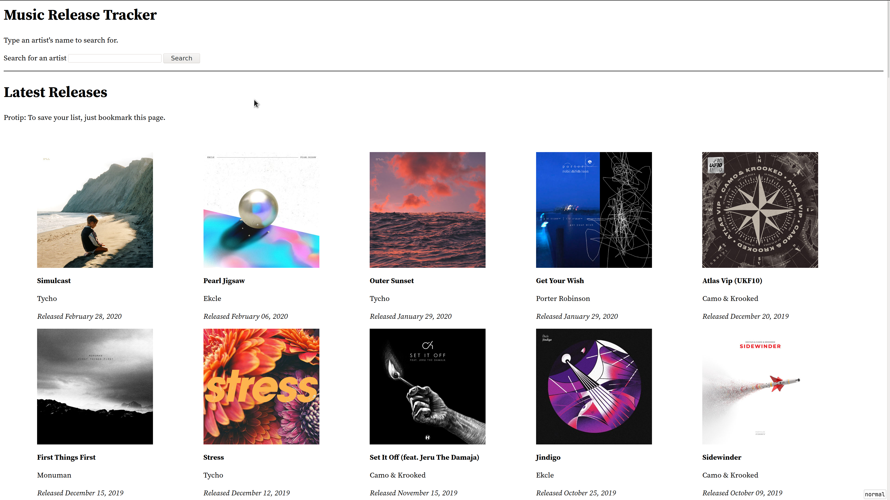

# Music Release Tracker

Keep track of your favorite artists' releases.

This is a little web app that uses the [Deezer API](https://developers.deezer.com/api/) to
list a given set of music artists' releases chronologically.
It lets you stay up to date on when your favorite artists release new music.

The app is completely stateless: it does not require any accounts.
You search for artists, and their respective IDs (in Deezer) are added to a parameter in the URL.
So, to save that list of artists so you can get back to it later, just bookmark the page and visit it later.
When you add new artists, just update your bookmark URL.
